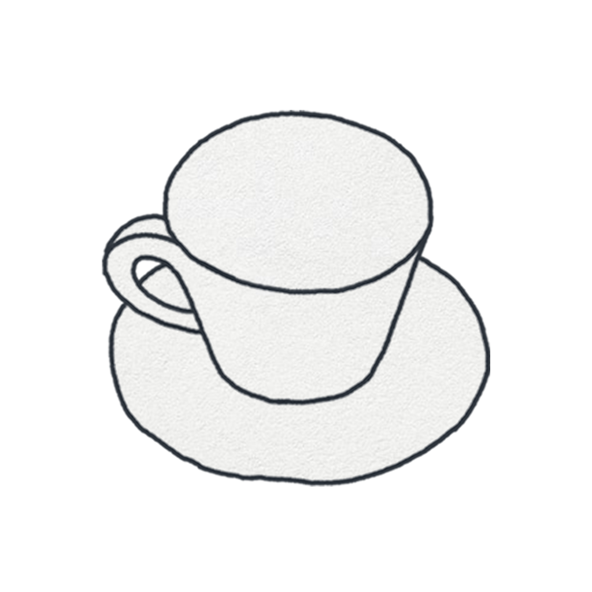

# CUPPO

커피 한 잔을 카드 한 장으로 남기는 기록 앱. 2023년 개인 프로젝트(Figma)를 HTML 프로토타입으로 복원하고, 정보 위계·선택 상태를 정돈한 뒤 5개 기능을 추가했습니다.



## 무엇이 담겨 있나

| 파일 | 내용 |
|---|---|
| `CUPPO Prototype.dc.html` | 인터랙티브 프로토타입 — 폰 프레임 + 16개 화면 갤러리, 라이트/다크 토글 |
| `CUPPO Design System.dc.html` | 팔레트 · 타입 스케일 · 레이아웃 스펙 · 에셋 43종 · 컴포넌트 6종 · 원본 대비 변경 진단 |
| `CuppoScreen.dc.html` | 화면 구현체. 모든 레이아웃 수치와 상태가 여기 있습니다 |
| `design_handoff_cuppo/` | 개발 핸드오프 패키지 (영문 README + 사본) |
| `assets/` | 원본 프로덕션 PNG 43종 + 로딩 GIF |

`.dc.html` 파일은 브라우저에서 바로 열립니다.

## 화면 16개

런치 · 온보딩 · 빈 상태 · 카드 피드 · 그리드 갤러리 · 캘린더 · 검색 · 메뉴 선택(STEP 1) · 레시피 커스텀(STEP 2) · 저장 · 카메라(누끼) · 기록 상세 · 카드 공유 · 취향 리포트 · 설정 · 위젯

기록 흐름: `메뉴 선택 → 레시피 커스텀 → 저장 → 피드`

## 기록 한 건

```
date · menu · temp · milk · syrup · deco · title · memo · time · photo
```

메뉴 8종(아메리카노 · 카페라떼 · 카푸치노 · 카페모카 · 핫초코 · 카라멜크림 · 말차라떼 · 딸기라떼), 온도 2 · 우유 3 · 시럽 6 · 장식 3.

잔 그림은 저장하지 않고 규칙으로 뽑습니다 — `hot/ice + 메뉴`에 휘핑(`_wip`)과 얼음 추가(`_ice`) 변형을 얹습니다.

## 원본에서 바꾼 것

1. 카드 안 제목·태그·시각의 무게를 분리 (14px 잉크 / 12px 45%)
2. 커스텀 탭 이름을 온도 · 우유 · 시럽 · 장식으로 통일
3. 선택 타일에 브라운 테두리 + 채움 + 체크 — 선택 상태가 보이게
4. 메뉴 선택을 STEP 1로 분리
5. 월 헤더 sticky + 종이 텍스처 배경
6. 설정 진입점을 탭바 하나로 정리

## 추가한 기능

사진 누끼 → 카드 · 유사 일러스트 추천 · 월간 취향 리포트 · 카페인 흐름(일 400mg 기준) · 위젯 원탭 기록

## 폰트

원본은 고양체(Goyang). 재배포가 어려워 프로토타입은 **Jost**(라틴·숫자) + **Gowun Dodum**(한글) + **IBM Plex Mono**(캡션 숫자)로 대체했습니다. 라이선스가 확보되면 고양체로 되돌리면 됩니다.

## 팔레트

`#F3F3F1` 종이 · `#2C2C2B` 종이(다크) · `#1F1F1E` 잉크 · `#EDEDEA` 잉크(다크) · `#8A5A3A` 커피 브라운 · `#C08A5C` 브라운(다크) · `#333333` 필름

라운드 없음, 그림자 없음, 그라디언트 없음. 종이 · 헤어라인 · 잔 그림이 전부입니다.

## 구현

목표 플랫폼은 Flutter. 화면별 명세, 데이터 모델, 위젯 트리 제안, 우선순위 로드맵은 [`design_handoff_cuppo/README.md`](design_handoff_cuppo/README.md)에 있습니다.
